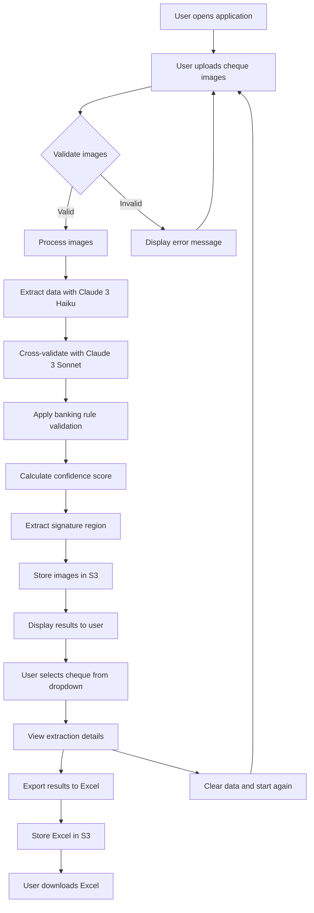
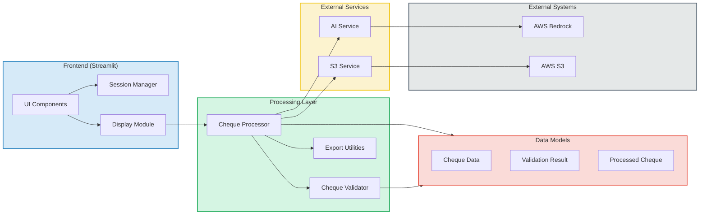
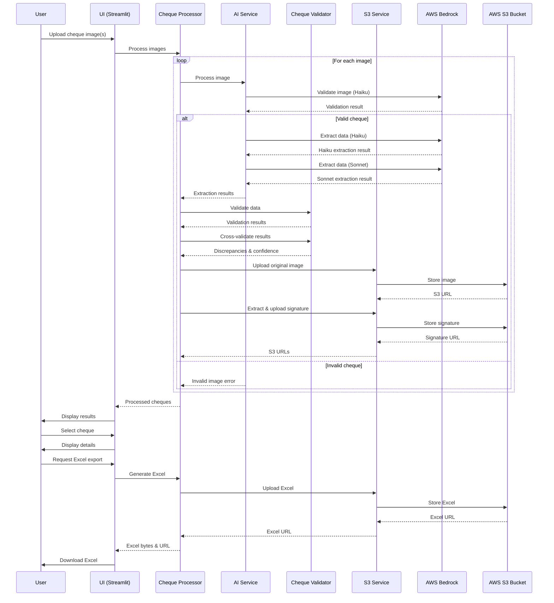
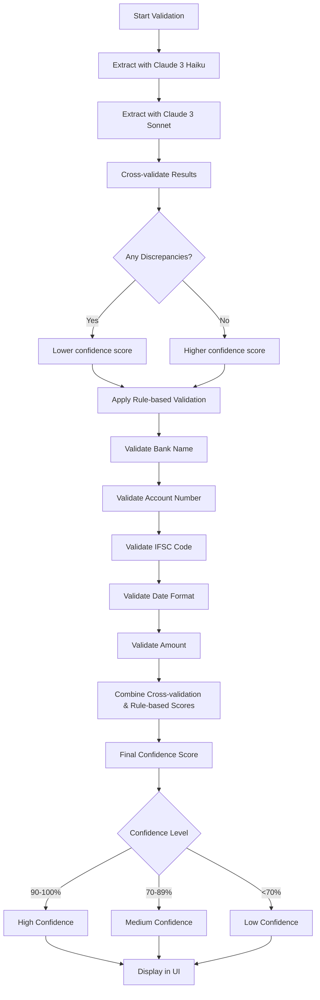
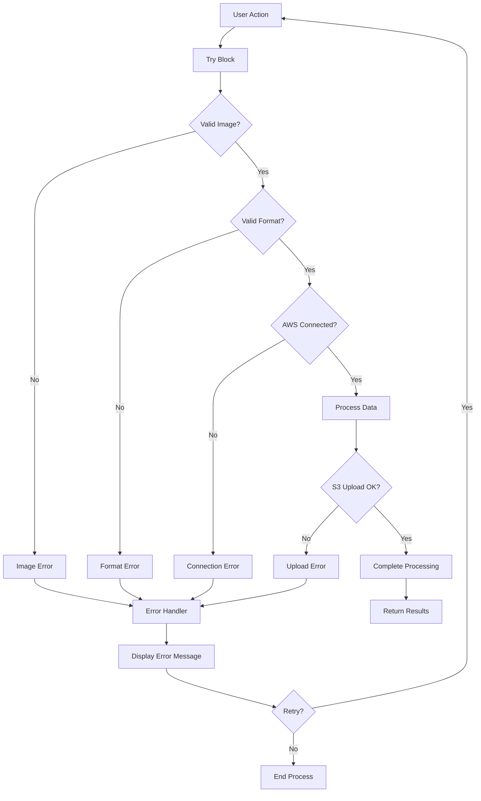

# Cheque Information Extractor - Flowcharts

This document contains flowcharts that illustrate the architecture and workflow of the Cheque Information Extractor application.

## Application Workflow



## System Architecture



## Data Processing Flow



## Validation Process



## S3 Storage Structure

```mermaid
flowchart TD
    s3[AWS S3 Bucket] --> processed[/processed/ folder]
    s3 --> signatures[/signatures/ folder]
    s3 --> reports[/excel_reports/ folder]
    
    processed --> cheque1[cheque_20240529_123456_123456789.jpg]
    processed --> cheque2[cheque_20240529_123457_987654321.jpg]
    processed --> chequeN[cheque_*.jpg]
    
    signatures --> sig1[signature_20240529_123456_123456789.jpg]
    signatures --> sig2[signature_20240529_123457_987654321.jpg]
    signatures --> sigN[signature_*.jpg]
    
    reports --> excel1[cheque_report_20240529_123456.xlsx]
    reports --> excel2[cheque_report_20240529_145623.xlsx]
    reports --> excelN[cheque_report_*.xlsx]
    
    classDef folder fill:#f9f9f9,stroke:#333,stroke-width:2px
    classDef file fill:#e8f4f8,stroke:#333,stroke-width:1px
    
    class s3,processed,signatures,reports folder
    class cheque1,cheque2,chequeN,sig1,sig2,sigN,excel1,excel2,excelN file
```

## Component Interaction

```mermaid
stateDiagram-v2
    [*] --> StreamlitUI: User Access
    StreamlitUI --> FileUpload: Upload Files
    
    state FileUpload {
        [*] --> CheckValidCheque
        CheckValidCheque --> ImageValidation: Valid
        CheckValidCheque --> Error: Invalid
        Error --> [*]
    }
    
    FileUpload --> ProcessorWorkflow: Process Images
    
    state ProcessorWorkflow {
        [*] --> AIService
        
        state AIService {
            [*] --> HaikuExtraction
            HaikuExtraction --> SonnetExtraction
            SonnetExtraction --> [*]
        }
        
        AIService --> ValidationService
        
        state ValidationService {
            [*] --> FieldValidation
            FieldValidation --> CrossValidation
            CrossValidation --> ConfidenceCalculation
            ConfidenceCalculation --> [*]
        }
        
        ValidationService --> S3Service
        
        state S3Service {
            [*] --> SaveChequeImage
            SaveChequeImage --> ExtractSignature
            ExtractSignature --> SaveSignature
            SaveSignature --> [*]
        }
    }
    
    ProcessorWorkflow --> ResultsDisplay: Processed Results
    
    state ResultsDisplay {
        [*] --> ChequeSelector
        ChequeSelector --> DetailedView
        DetailedView --> ExportData
        ExportData --> [*]
    }
    
    ResultsDisplay --> SessionClear: Clear Session
    SessionClear --> FileUpload: Start Again
```



## Error Handling Flow

